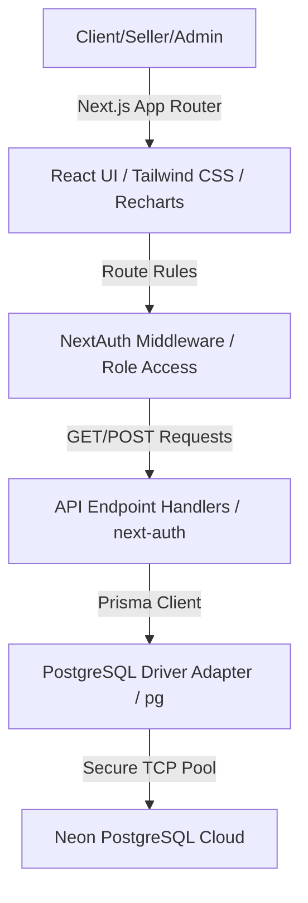

# ChemFlow - Chemical Inventory & Order Management System

ChemFlow is a modern, responsive, role-based SaaS dashboard built for chemical inventory monitoring, compliance auditing, quotation compilation, and purchase order tracking. It provides specialized user portals tailored to three key roles: **Admin**, **Seller**, and **Client User**.

---

## 🏛️ System Architecture

ChemFlow is built on top of Next.js 15, PostgreSQL (via Neon serverless hosting), Prisma ORM, and NextAuth. Below is a structural flow of the application stack:



### Key Architectural Decisions

#### 🔬 Why PostgreSQL `NUMERIC` (Prisma `Decimal`) for Price and Quantity?
By design, floating-point numbers (`Float` / `Double Precision`) store numbers using binary approximations. This can introduce rounding issues, such as:
$$\text{0.1} + \text{0.2} = \text{0.30000000000000004}$$
While negligible in casual applications, floating-point drift is **unacceptable** in two critical domains:
1. **Financial Audits**: Small rounding drifts compile over thousands of line items, leading to billing discrepancies.
2. **Chemical Formulations**: Precision is critical. Dispensing $0.0005\text{ g}$ of a reagent must be exact. If floats round this to $0.0004\text{ g}$, it violates standard regulatory requirements (ISO 9001, GxP, FDA standards).

PostgreSQL `NUMERIC` (and its Prisma equivalent `Decimal`) stores numbers as exact strings in decimal notation under the hood. For this system:
- **Quantities**: Stored as `@db.Decimal(12, 4)` (supporting measurements down to $0.0001\text{ units}$, such as $0.1\text{ mg}$ or $0.1\text{ mL}$).
- **Catalog Price**: Stored as `@db.Decimal(12, 4)` (supporting prices up to $\$99,999,999.9999$).
- **Aggregated Totals**: Stored as `@db.Decimal(16, 4)` (supporting invoice subtotals up to $\$999,999,999,999.9999$).

---

## 🔐 Authentication & Session Flow

Authentication is managed via **NextAuth v4** utilizing the `Credentials` provider.

```
[User Login Input] ──> [API Login Handler] ──> [Prisma Query (User Email)]
                                                      │
[Success Redirect] <── [Verify Password (Bcrypt)] <───┘
        │
[JWT Payload Created] ──> [JWT Custom Role Callback] ──> [App Session State]
```

- **Role-based Protection**: Next.js `middleware.ts` interceptor blocks path segments. Admin pages (`/admin/*`) require the `ADMIN` role. Seller pages (`/seller/*`) require `SELLER` or `ADMIN`. Client User pages (`/user/*`) require authenticated access.
- **Unauthorized Interceptor**: Route blocks redirect to `/unauthorized` to prevent raw 404 errors.

---

## 📏 Unit Conversion & Pricing Strategy

To maintain storage consistency, all chemical quantities are normalized to base units before being saved to the database:
- **Weights**: Normalized and stored internally in **Grams (G)**.
- **Volumes**: Normalized and stored internally in **Milliliters (ML)**.
- **Counts**: Normalized and stored internally in **Items (ITEM)**.

### Pricing Calculations Formula
When a client creates a purchase order, the catalog unit price (e.g. $\$18.50\text{ per L}$) is applied by converting the ordered quantity to match the product's catalog unit:
$$\text{Line Cost} = \text{Product Price} \times \text{ConvertUnit}(\text{Order Quantity}, \text{Order Unit} \rightarrow \text{Catalog Price Unit})$$

*Example*: Buying $500\text{ mL}$ of a chemical priced at $\$10.00\text{ / L}$:
$$\text{ConvertUnit}(500\text{ mL} \rightarrow \text{L}) = 0.5000\text{ L}$$
$$\text{Line Cost} = \$10.00 \times 0.5000 = \$5.00$$

---

## 📂 Project Directory Structure

```
src/
├── app/                    # Routing App Router
│   ├── (auth)/             # Auth group: login/register
│   ├── (dashboard)/        # Main portal workspace
│   │   ├── admin/          # Admin pages (Metrics, Catalog, Logs)
│   │   ├── seller/         # Seller views (Browse, Quotes)
│   │   └── user/           # User client views (Catalog, My orders)
│   ├── api/                # NextAuth and user registration handlers
│   └── unauthorized/       # Blocked user page fallback
├── components/
│   ├── charts/             # Recharts (Revenue, Orders, Categories)
│   ├── shared/             # Breadcrumbs, Sidebar, ErrorBoundary, Calculator
│   └── ui/                 # Custom button, table, input, card, toast
├── lib/
│   ├── auth.ts             # Credentials & JWT session configs
│   ├── db.ts               # Prisma Client PostgreSQL adapter setup
│   └── unit-converter.ts   # Precision math conversions
└── types/
    └── next-auth.d.ts      # Auth interface overrides
```

---

## 🛠️ API & Endpoints Design

| Method | Endpoint | Description | Access |
| :--- | :--- | :--- | :--- |
| **POST** | `/api/auth/register` | Registers a new account and hashes password | Public |
| **POST** | `/api/auth/callback` | NextAuth callback endpoint | Public |
| **GET** | `/api/auth/session` | Fetches active user session parameters | Authenticated |

---

## 🚀 Setup & Execution Guide

### Local Setup
1. **Clone the repository** and make sure you navigate to the root directory `C:\Users\Ankit\.gemini\antigravity\scratch\chemical-inventory-system`.
2. **Install dependencies**:
   ```bash
   npm install
   ```
3. **Configure Environment variables**: Create a `.env` file at the project root using the `.env.example` template:
   ```env
   DATABASE_URL="postgresql://[user]:[password]@[neon-host]/neondb?sslmode=require"
   NEXTAUTH_SECRET="your-32-char-random-auth-key-secret"
   NEXTAUTH_URL="http://localhost:3000"
   ```

### Database Cloud Setup (Neon PostgreSQL)
1. Sign up on [Neon.tech](https://neon.tech/) and create a free PostgreSQL project.
2. Copy the connection string (ensure pooling or direct URI parameters matches target environment).
3. Synchronize tables using the Prisma CLI:
   ```bash
   npx prisma db push
   ```

### Execution
1. Compile and launch the local Next.js development server:
   ```bash
   npm run dev
   ```
2. Open [http://localhost:3000](http://localhost:3000) in your browser.

---

## 🖥️ Production Cloud Deployment (Vercel)

1. Push this codebase to a GitHub, GitLab, or Bitbucket repository.
2. Link your repository in [Vercel Dashboard](https://vercel.com).
3. Input the required production Environment Variables in Vercel settings:
   - `DATABASE_URL` (your Neon connection string)
   - `NEXTAUTH_SECRET` (generate a base64 string using `openssl rand -base64 32`)
   - `NEXTAUTH_URL` (your deployed Vercel domain, e.g. `https://chemflow.vercel.app`)
4. Click **Deploy**. Vercel will build, optimize static segments, and host the Next.js app automatically.

---

## 🧪 Demo / Test Accounts

To simplify testing all three roles, the Registration portal (`/register`) allows you to choose your account role during registration. Create accounts as needed or sign in:

| Email | Password | Role | Description |
| :--- | :--- | :--- | :--- |
| `admin@chemflow.com` | `admin123` | **ADMIN** | Full stock log access and audits |
| `bob@chemflow.com` | `bob123` | **SELLER** | Access to client pricing tools |
| `pfizer@pfizer.com` | `pfizer123` | **USER** | Browse and order items |

---

## 📝 Key Assumptions & Future Roadmaps

### Assumptions
- **Uniform Density**: Liquid chemicals conversion assumes a density equivalent of $1\text{ kg} = 1\text{ L}$ for basic unit matching, unless customized product specific gravity coefficients are mapped in future databases.
- **Local Dev Auth Secret**: Local auth sessions default to a 30-day session expiry strategy.

### Future Roadmaps
1. **Safety Data Sheets (SDS)**: Attach chemical hazard symbols, NFPA 704 fire diamonds, and OSHA compliance documents to catalog cards.
2. **Warehouse Shelf Scanning**: Support barcode and QR scanning integration on mobile views to instantly update inventory batch details.
3. **Multi-Currency Pricing**: Integrate multi-currency exchange rates inside the Unit Conversion Engine for international shipments.
